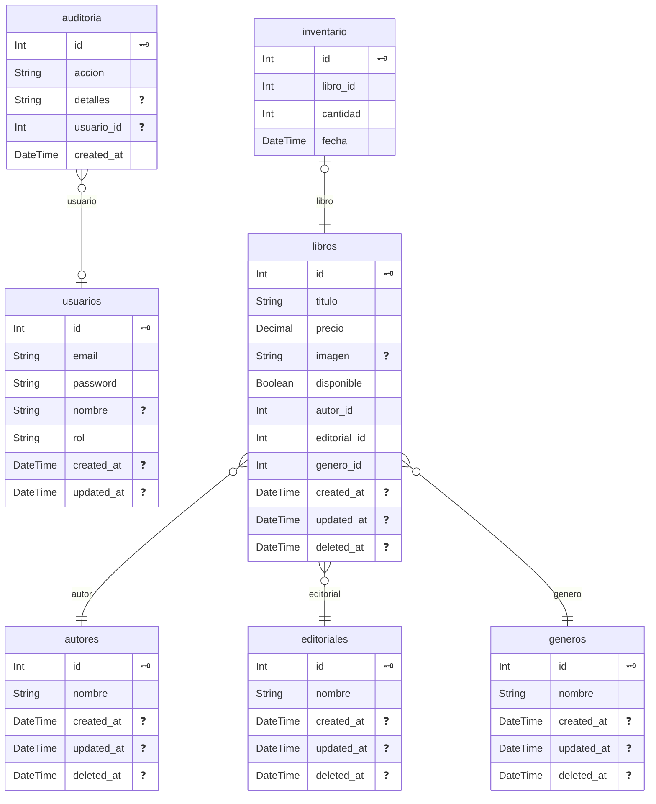

```mermaid
erDiagram

  "usuarios" {
    Int id "🗝️"
    String email 
    String password 
    String nombre "❓"
    String rol 
    DateTime created_at "❓"
    DateTime updated_at "❓"
    }
  

  "autores" {
    Int id "🗝️"
    String nombre 
    DateTime created_at "❓"
    DateTime updated_at "❓"
    DateTime deleted_at "❓"
    }
  

  "editoriales" {
    Int id "🗝️"
    String nombre 
    DateTime created_at "❓"
    DateTime updated_at "❓"
    DateTime deleted_at "❓"
    }
  

  "generos" {
    Int id "🗝️"
    String nombre 
    DateTime created_at "❓"
    DateTime updated_at "❓"
    DateTime deleted_at "❓"
    }
  

  "libros" {
    Int id "🗝️"
    String titulo 
    Decimal precio 
    String imagen "❓"
    Boolean disponible 
    Int autor_id 
    Int editorial_id 
    Int genero_id 
    DateTime created_at "❓"
    DateTime updated_at "❓"
    DateTime deleted_at "❓"
    }
  

  "inventario" {
    Int id "🗝️"
    Int libro_id 
    Int cantidad 
    DateTime fecha 
    }
  

  "auditoria" {
    Int id "🗝️"
    String accion 
    String detalles "❓"
    Int usuario_id "❓"
    DateTime created_at 
    }
  
    "libros" }o--|| "autores" : "autor"
    "libros" }o--|| "editoriales" : "editorial"
    "libros" }o--|| "generos" : "genero"
    "inventario" |o--|| "libros" : "libro"
    "auditoria" }o--|o "usuarios" : "usuario"
```
